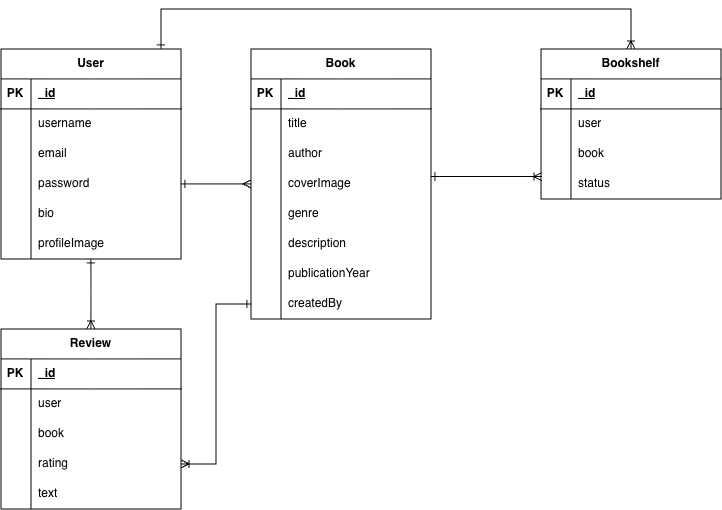
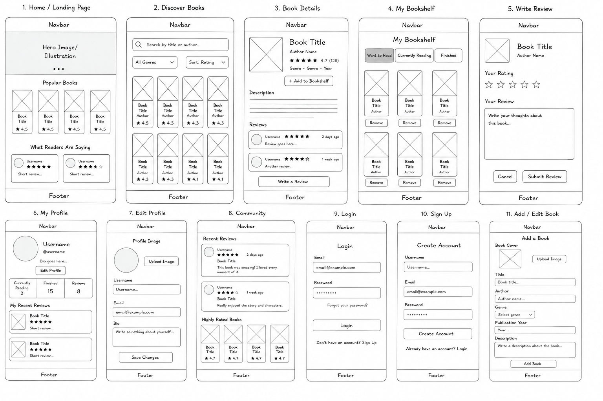

# Waraq
 
Waraq is a social reading platform where users can discover books, manage their personal bookshelf, track their reading progress, and share reviews and ratings with other readers.

---

## Features

### User Accounts

* Create an account
* Log in and log out
* Create and edit a profile
* Add a bio and profile image
* Manage personal content

### Books

* Browse available books
* View individual book details
* Add books
* Edit books you created
* Delete books you created
* Search by title or author
* Filter by genre

### Personal Bookshelf

Users can organize books into:

* **Want to Read**
* **Currently Reading**
* **Finished**

Users can add books to their bookshelf, change their reading status, and remove books.

### Reviews & Ratings

Users can:

* Write reviews
* Rate books from 1–5 stars
* Edit their own reviews
* Delete their own reviews
* Read reviews from other users

### Community

Users can discover:

* Books other readers are reading
* Public reviews
* Highly rated books
* Other readers and their profiles

---

# User Stories

## Guest User

* As a **guest**, I want to view the home page so that I can understand what Waraq offers.
* As a **guest**, I want to browse books so that I can discover books before creating an account.
* As a **guest**, I want to view individual book details so that I can learn more about a book.
* As a **guest**, I want to read public reviews so that I can see what other readers think.
* As a **guest**, I want to search for books so that I can quickly find a book.
* As a **guest**, I want to sign up so that I can access Waraq's personal reading features.
* As a **guest**, I should not be able to create, edit, or delete application data.

## Registered User

* As a **registered user**, I want to log in so that I can access my personal account.
* As a **registered user**, I want to log out so that my account remains secure.
* As a **registered user**, I want to create a profile so that other readers can learn about me.
* As a **registered user**, I want to edit my profile so that my information stays up to date.

## Bookshelf

* As a **reader**, I want to add a book to my bookshelf so that I can keep track of books I am interested in.
* As a **reader**, I want to mark a book as "Want to Read" so that I can remember books I plan to read.
* As a **reader**, I want to mark a book as "Currently Reading" so that I can track what I am reading now.
* As a **reader**, I want to mark a book as "Finished" so that I can keep a record of books I have completed.
* As a **reader**, I want to remove a book from my bookshelf so that I can keep my library organized.

## Reviews & Ratings

* As a **reader**, I want to rate a book from 1–5 stars so that I can express my opinion.
* As a **reader**, I want to write a review so that I can share my thoughts about a book.
* As a **reader**, I want to edit my review so that I can correct or update what I wrote.
* As a **reader**, I want to delete my review so that I can remove content I no longer want to publish.
* As a **reader**, I want to read other users' reviews so that I can discover different opinions about books.

## Book Discovery

* As a **reader**, I want to search by book title so that I can quickly find a specific book.
* As a **reader**, I want to search by author so that I can discover books by an author I like.
* As a **reader**, I want to filter books by genre so that I can discover books matching my interests.
* As a **reader**, I want to see book ratings so that I can identify highly rated books.

## Authorization

* As a **user**, I want only my own content to be editable or deletable so that other users cannot modify my data.
* As a **user**, I want other users to see my public reviews without being able to edit them.
* As a **guest**, I should not have access to actions that create, update, or delete data.

---

## ERD

---

## Wireframes

---

## Technologies Used

* JavaScript
* Node.js
* Express.js
* MongoDB & Mongoose
* EJS (Embedded JavaScript Templates)
* CSS3 & HTML5
* express-session
* bcrypt
* method-override
* dotenv
* morgan
* Cloudinary (image hosting)
* Figma
* Git & GitHub
